<div align="center">
  

# 소담소담

**내 조건에 맞는 정부 지원정책을 찾고, 자격 확인부터 신청까지 한 번에**

[](https://vuejs.org/)
[](https://vite.dev/)
[](https://pinia.vuejs.org/)
[](https://www.krds.go.kr/)

[GitHub Repository](https://github.com/skala-msa-vue/shiny-vue)

</div>

<br />

<div align="center">
  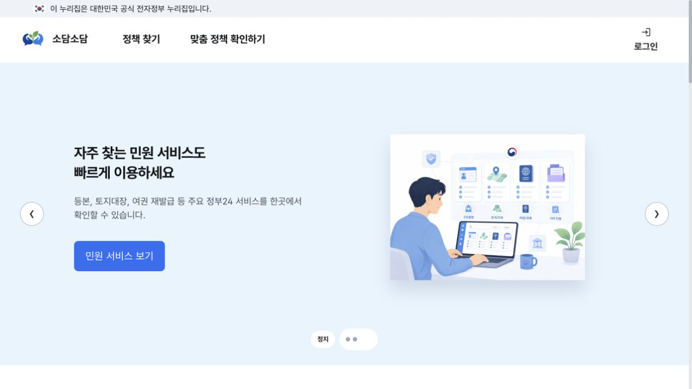
</div>

<br />

## 프로젝트 소개

**소담소담**은 여러 정부 부처와 지자체에 흩어진 지원정책을 한곳에서 탐색하고, 사용자의 조건에 맞는 정책을 확인할 수 있도록 만든 **B2G2C 맞춤형 정책 지원 플랫폼**입니다.

청년·신혼부부·소상공인·고령층 등 정책 수혜자는 복잡한 공고를 직접 비교하지 않고도 정책을 검색하고 신청 가능성을 확인할 수 있습니다. 공공기관은 지원 대상자에게 정책을 더 정확하게 전달하고, 반복적인 자격 검토와 민원 부담을 줄일 수 있습니다.

| 문제 | 소담소담의 해결 방식 |
| --- | --- |
| 정책 정보가 기관별 사이트에 흩어져 탐색 비용이 큼 | 분야·지역·키워드 기반의 통합 정책 검색 제공 |
| 공고의 자격 조건이 복잡해 신청 가능 여부를 판단하기 어려움 | 지역·사업자 유형·업력·매출·근로자 수를 기준으로 사전 자격 확인 |
| 사용자에게 맞는 정책을 직접 비교해야 함 | 사용자 프로필과 관심 분야를 활용한 맞춤 정책 추천 |
| 정책을 찾은 뒤 신청 과정이 단절됨 | 정책 선택 → 자격 확인 → 신청서 작성 → 접수 현황을 하나의 흐름으로 연결 |

> 이 저장소는 **소담소담 프론트엔드**를 담당합니다. Vue 3와 KRDS 컴포넌트를 기반으로 시민용 정책 탐색·검증·신청 화면과 OAuth2 인증 흐름을 구현했습니다.

<br />

## 핵심 기능

### 1. 정책 중심 홈 화면

주요 정책과 서비스 가치를 Hero 캐러셀로 안내하고, 지금 신청할 수 있는 정책·주요 지원사업·정책 소식을 한 화면에 구성했습니다. Hero 이미지는 WebP로 최적화하고 자동 재생, 일시정지, 이전·다음 탐색을 제공합니다.

<div align="center">
  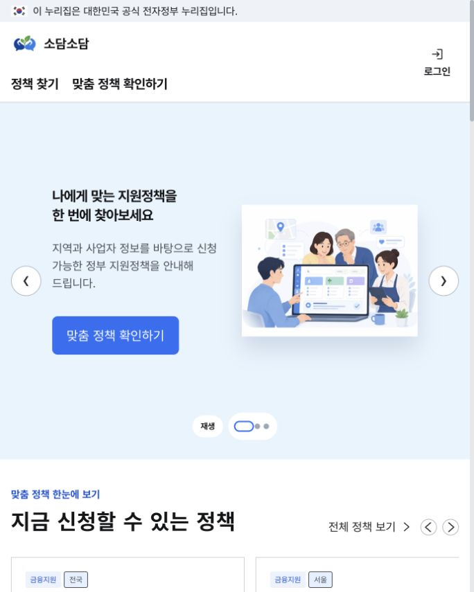
  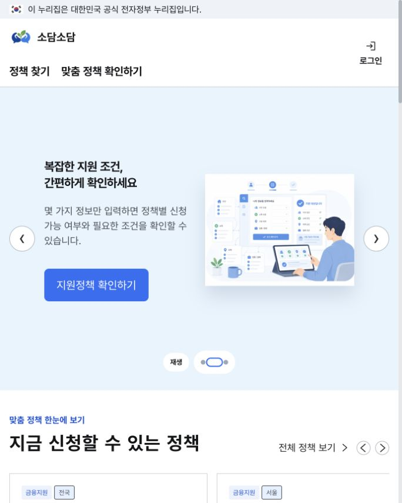
  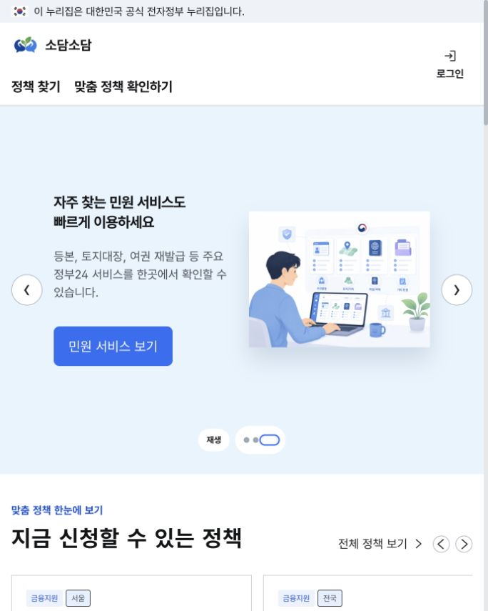
</div>

### 2. OAuth2 로그인과 회원가입

KRDS 로그인 패턴을 기반으로 아이디·비밀번호 입력, 아이디 저장, 계정 도움말과 회원가입 화면을 구현했습니다. 실제 인증은 Authorization Code Flow로 진행하며, 콜백에서 Access Token을 발급받아 Pinia와 `sessionStorage`에 저장합니다.

<div align="center">
  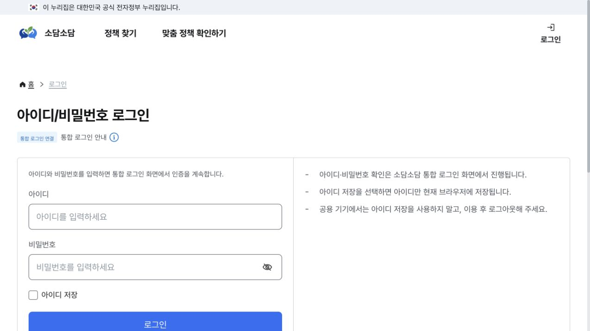
</div>

### 3. 지원정책 검색

정책명·기관명·지원내용을 검색하고 지원 분야와 사업장 지역으로 결과를 필터링할 수 있습니다. 검색 결과가 없을 때는 조건 초기화와 전체 정책 보기 동작을 제공해 탐색이 끊기지 않도록 했습니다.

<div align="center">
  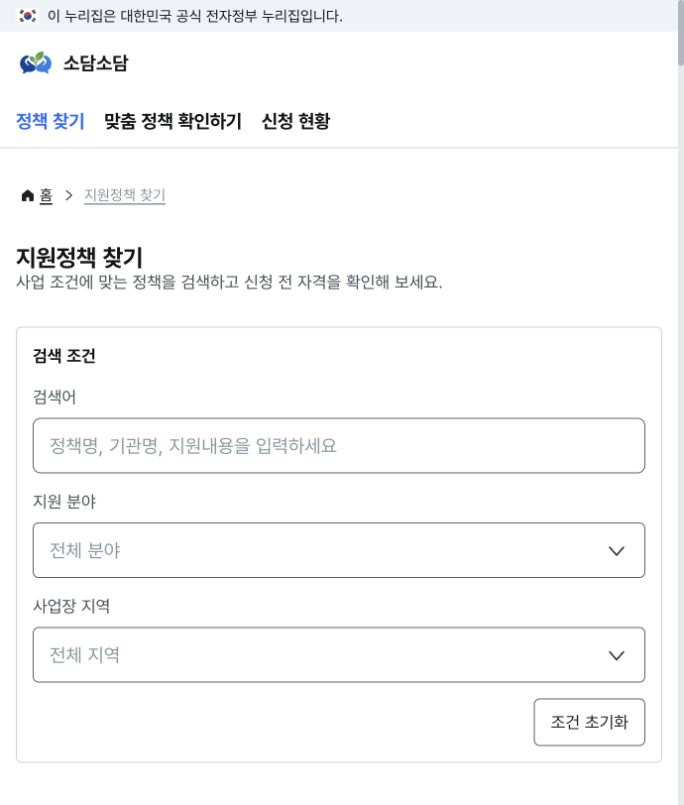
</div>

### 4. 신청 자격 사전 검증

사용자가 입력한 지역, 사업자 유형, 업력, 연 매출액, 상시근로자 수를 정책의 자격 규칙과 비교합니다. 조건별 통과 여부와 최종 신청 가능성을 함께 보여 주고, 자격을 충족한 경우 신청 화면으로 연결합니다.

<div align="center">
  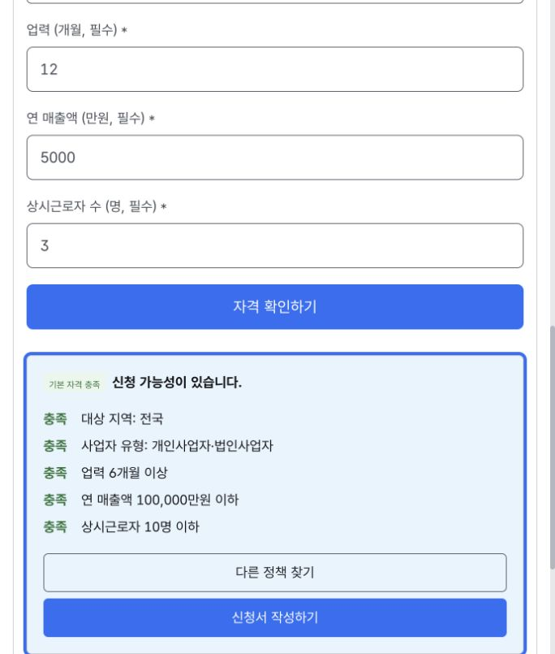
</div>

### 5. 맞춤 정책 추천

대상 유형, 나이, 지역, 소득 구간, 가구원 수와 관심 분야를 입력받아 추천 API를 호출합니다. API 응답이 없거나 연결에 실패하면 동일한 화면에서 로컬 정책 데이터를 점수화해 최대 3개의 추천 결과를 제공합니다.

<div align="center">
  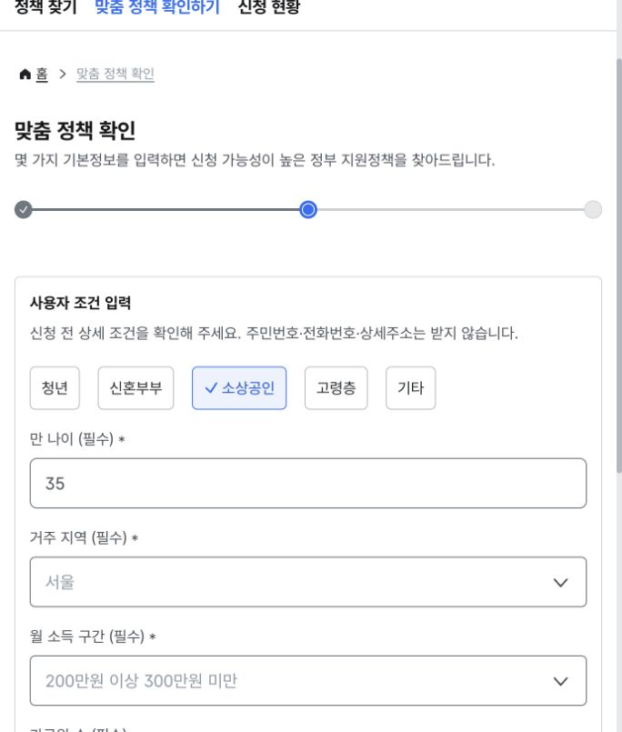
  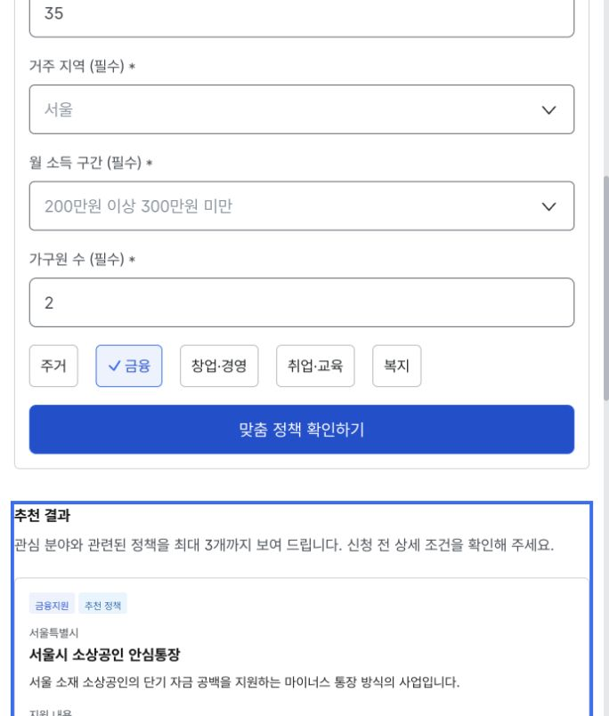
</div>

### 6. 정책 신청과 진행 상태 확인

정책 정보와 신청자 정보를 확인하고 필수 동의 후 신청서를 제출할 수 있습니다. 접수 완료 시 신청번호를 발급하며, 신청 현황 화면에서 접수·심사·승인·보완 상태를 확인할 수 있도록 구성했습니다.

<div align="center">
  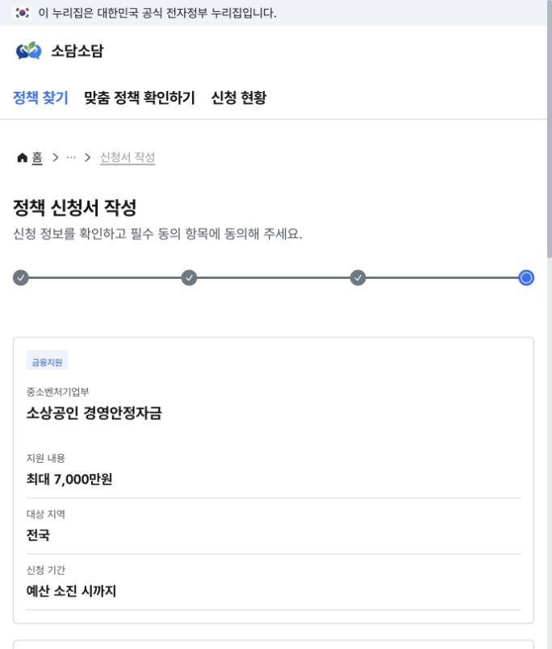
  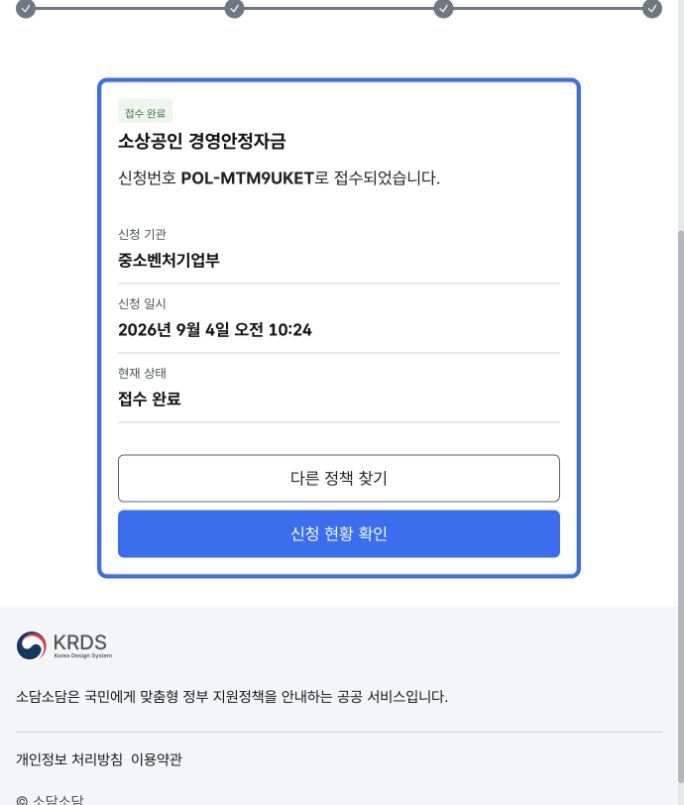
  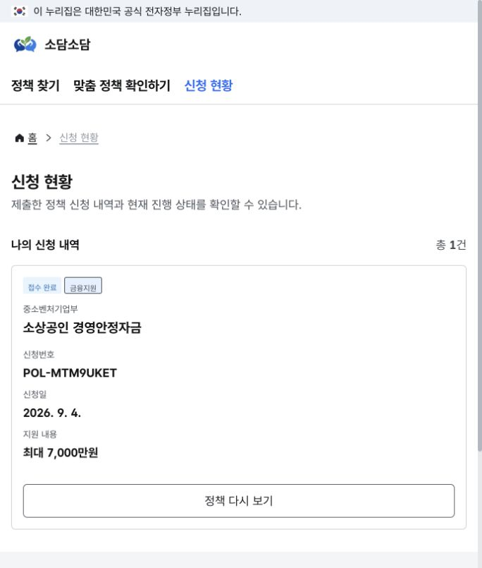
</div>

<br />

## 사용자 흐름

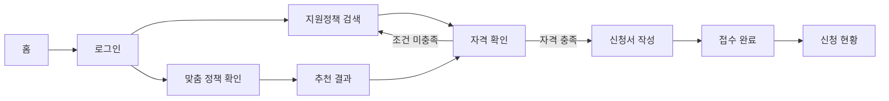

<br />

## 기술적으로 신경 쓴 부분

<details>
<summary><b>KRDS 기반의 일관된 공공서비스 UI</b></summary>
<br />

버튼, 입력창, 선택창, 배지, 단계 표시기, 경로 안내와 푸터에 `krds-vue` 컴포넌트를 사용했습니다. 장식보다 정보 위계를 우선하고, 명확한 레이블과 오류 메시지, 키보드 포커스와 본문 바로가기를 적용해 공공서비스에 필요한 사용성과 접근성을 확보했습니다.

</details>

<details>
<summary><b>인증 상태와 역할별 라우팅</b></summary>
<br />

Pinia에서 Access Token과 사용자 정보를 관리하고 Vue Router 가드에서 인증이 필요한 화면을 보호합니다. 비로그인 사용자는 로그인 화면으로 이동시키고, 로그인 사용자는 역할에 따라 정책 검색 또는 관리자용 공고 화면으로 이동합니다.

</details>

<details>
<summary><b>정책 자격조건 엔진</b></summary>
<br />

정책 데이터와 판정 로직을 분리했습니다. 정책별 `eligibility` 규칙을 사용자 입력과 비교해 각 조건의 통과 여부를 계산하므로, 화면 코드를 변경하지 않고도 정책별 기준을 추가하거나 수정할 수 있습니다.

</details>

<details>
<summary><b>추천 API 장애 시 대체 결과 제공</b></summary>
<br />

추천 API의 응답 형식을 정규화한 뒤 최대 3개 정책을 노출합니다. API가 비어 있거나 일시적으로 실패하면 관심 분야, 지역과 대상 유형을 기준으로 로컬 정책의 점수를 계산해 대체 결과를 제공합니다. 백엔드 상태와 관계없이 전체 사용자 흐름을 시연할 수 있습니다.

</details>

<details>
<summary><b>단계가 분명한 신청 경험</b></summary>
<br />

정책 선택 → 자격 확인 → 신청서 작성 → 접수 완료를 단계 표시기로 연결했습니다. 필수 동의 검증, 완료 화면 포커스 이동, 신청번호 발급과 신청 내역 조회를 구현해 사용자가 현재 위치와 다음 행동을 쉽게 이해할 수 있도록 했습니다.

</details>

<details>
<summary><b>반응형 화면과 이미지 최적화</b></summary>
<br />

데스크톱에서는 정보 탐색에 적합한 다단 레이아웃을, 모바일에서는 한 열 중심의 화면을 제공합니다. Hero 이미지는 4:3 비율의 WebP로 변환해 시각적 품질을 유지하면서 초기 로딩 용량을 줄였습니다.

</details>

<br />

## API 연동 현황

개발 환경에서는 Vite 프록시가 `http://localhost:8080`의 API Gateway로 요청을 전달합니다.

| Domain | Endpoint | 구현 내용 |
| --- | --- | --- |
| OAuth2 | `GET /oauth2/authorize` | 통합 로그인 화면으로 이동 |
| OAuth2 | `POST /oauth2/token` | Authorization Code를 Access Token으로 교환 |
| User | `POST /api/users/register` | 회원가입 |
| User | `GET /api/users/me` | 로그인 사용자 정보 조회 |
| Recommendation | `GET /api/recommend/{userId}` | 사용자 기반 맞춤 정책 추천 |
| Policy/Course | `GET /api/courses` | 정책 공고 목록 조회 |
| Policy/Course | `GET /api/courses/{id}` | 정책 공고 상세 조회 |
| Policy/Course | `POST /api/courses` | 담당자 정책 공고 등록 |
| Application | `GET /api/enrollments/my` | 사용자 신청 내역 조회 |
| Application | `POST /api/enrollments` | 정책 신청 접수 |
| Application | `DELETE /api/enrollments/{id}` | 신청 취소 |

### 현재 프론트엔드 데모 범위

| 기능 | 데이터 처리 방식 |
| --- | --- |
| 로그인·회원가입·사용자 정보 | 백엔드 API 연동 |
| 맞춤 정책 추천 | 추천 API 우선, 실패 시 목업 데이터 사용 |
| 정책 검색·자격 검증 | 프론트엔드 목업 정책과 규칙 엔진 사용 |
| 정책 신청·신청 현황 | `localStorage` 기반 데모 구현 |

<br />

## 기술 스택

**Core**

`Vue 3` · `JavaScript` · `Vite 8`

**State & Routing**

`Pinia` · `Vue Router`

**UI & Accessibility**

`KRDS Vue` · `Semantic HTML` · `Responsive CSS`

**Network & Authentication**

`Axios` · `OAuth2 Authorization Code Flow` · `Bearer Token`

**Deployment**

`Docker` · `Nginx`

<br />

## 아키텍처

<div align="center">
  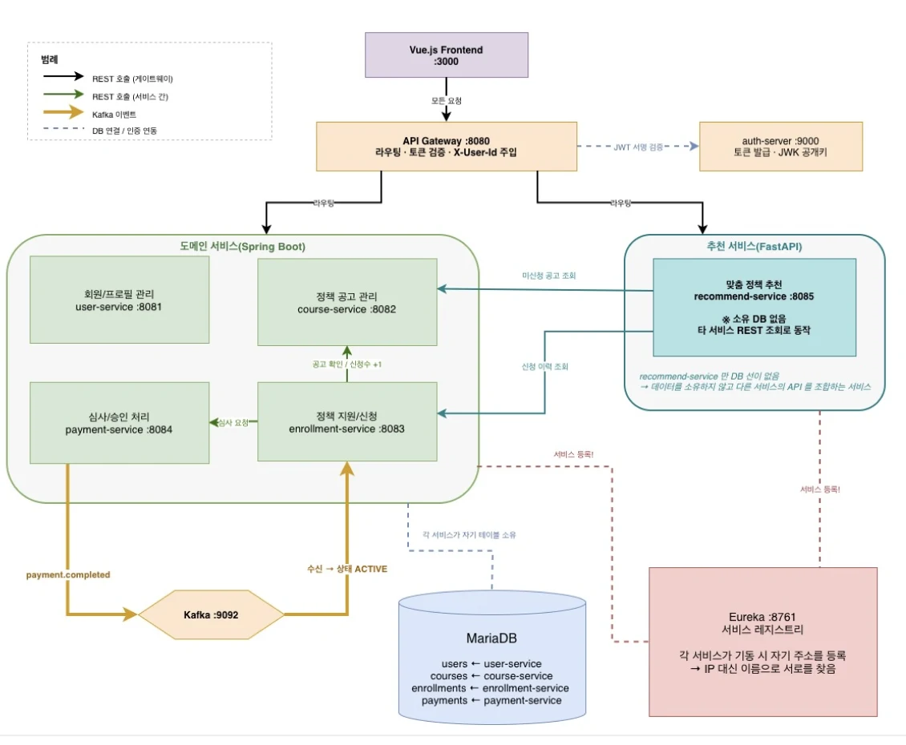
</div>

<br />

## 폴더 구조

```text
src/
├─ api/                    # Axios 인스턴스와 도메인별 API
├─ assets/
│  ├─ images/              # 로고, 홈 Hero 및 콘텐츠 이미지
│  └─ styles/              # 전역·홈 화면 스타일
├─ components/
│  ├─ common/              # 공통 카드·아이콘·섹션 제목
│  ├─ home/                # Hero, 정책·뉴스·민원 섹션
│  └─ layout/              # 헤더, 내비게이션, 푸터
├─ composables/            # 캐러셀 자동 재생 등 재사용 로직
├─ data/                   # 정책 목업, 자격 규칙, 신청 데이터 처리
├─ router/                 # 화면 경로와 인증·역할 가드
├─ store/                  # Pinia 인증·정책 상태
└─ views/                  # 로그인, 검색, 자격 확인, 추천, 신청 화면
```

<br />

## Getting Started

### 1. 실행 환경

- Node.js 20 이상
- npm
- 선택 사항: `http://localhost:8080`에서 실행 중인 API Gateway

### 2. 설치

```bash
git clone https://github.com/skala-msa-vue/shiny-vue.git
cd shiny-vue
npm install
```

### 3. 환경 변수

```bash
cp .env.example .env
```

`.env`에서 백엔드 주소와 OAuth2 클라이언트 정보를 실행 환경에 맞게 설정합니다.

```dotenv
VITE_API_BASE_URL=http://localhost:8080
VITE_AUTH_SERVER_URL=http://localhost:8080
VITE_CLIENT_ID=web-client
VITE_CLIENT_SECRET=web-secret
VITE_REDIRECT_URI=http://localhost:3000/callback
```

### 4. 개발 서버 실행

```bash
npm run dev
```

기본 접속 주소는 `http://localhost:3000`입니다.

### 5. 프로덕션 빌드

```bash
npm run build
```

빌드 결과는 `dist/` 디렉터리에 생성됩니다.

<br />

## 향후 고도화

- 정책 검색·자격 검증·신청 현황 API 완전 연동
- 공공기관 담당자용 정책 등록·수정·심사 대시보드 구축
- 사용자 프로필과 행정·금융 데이터를 활용한 추천 정확도 개선
- 정책 변경 이력과 신청 단계별 알림 기능 제공
- 정책 예산 소진율, 심사 처리시간과 신청 전환율 분석 기능 제공
